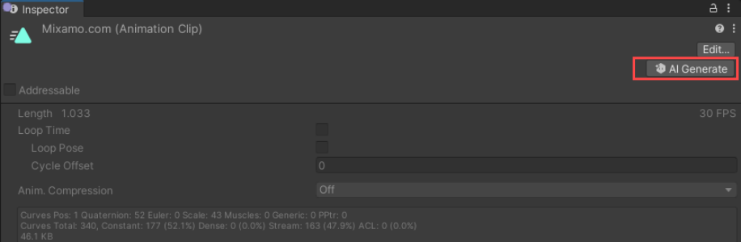

# 在引擎中使用AI Generate

团结引擎内多个核心原生组件中都嵌入了**AI Generate 一键入口**，允许开发者无需跳出组件 Inspector，即可快速生成、替换或编辑所选对象的 AI 资产。每个入口自动关联推荐的AI Artist Workflow模版，保障用户操作流畅、资产结构规范，进一步加速 AIGC 能力与实际生产流程的融合。

当前版本包含AI Generate 入口的组件如下：

| 组件名                                | 导航至工作流模板 |
| ------------------------------------- | ---------------- |
| MeshFilter                            | 3D               |
| MeshRenderer                          | 3D               |
| SkinnedMeshRenderer                   | 3D               |
| Sprite renderer                       | 2D               |
| Animation Editor                      | Animation        |
| Animator State（Controller 面板内）   | Animation        |
| Animation Clip                        | Animation        |
| Material Editor                       | Material         |
| Particle System（Material位置）       | Material         |
| Lighting（Material位置）              | Material         |
| Skybox                                | Material         |

Animation Clip组件中的AI Generate按钮示例：

