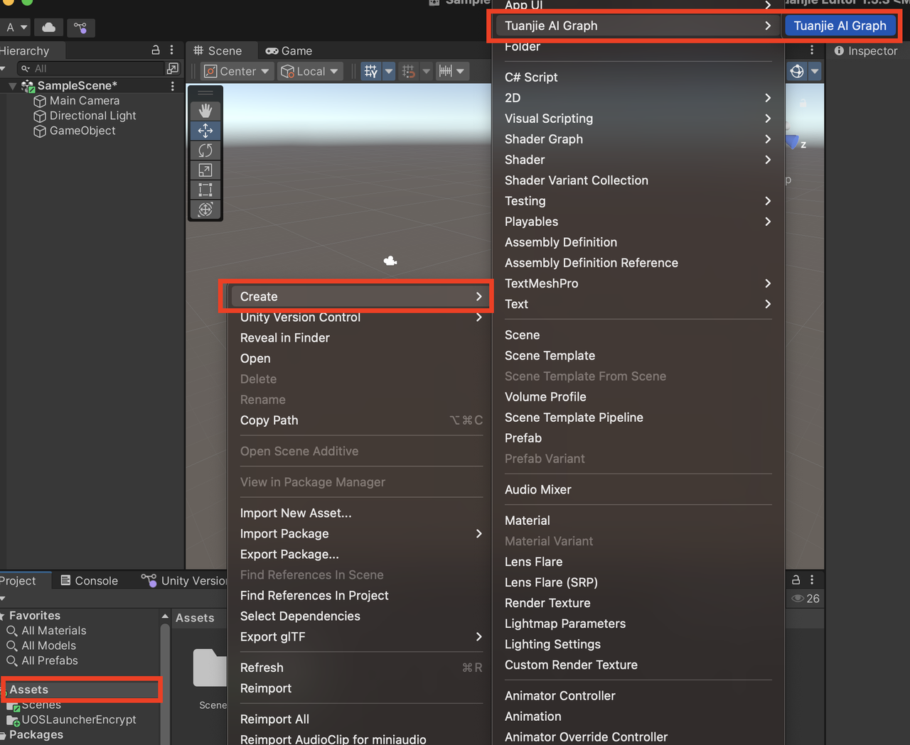
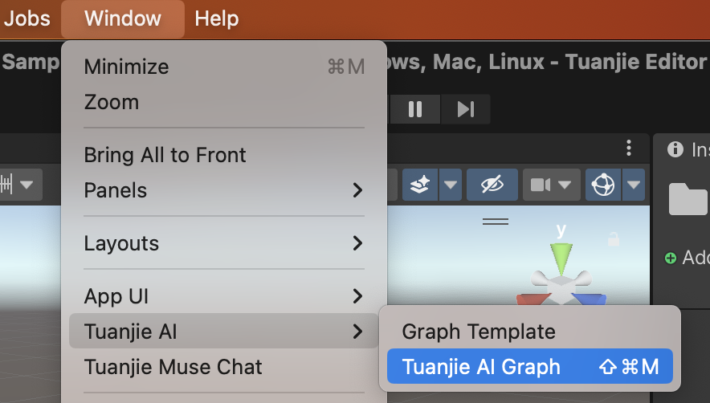

# 创建新的 AI Graph

创建新的AI Graph，有两种方式: 

1. 在Assets里创建新的TJAI Graph: **Assets -> 右键Create -> Tuanjie AI Graph -> Tuanjie AI Graph**

1. Window创建Tuanjie AI Graph：**Window -> Tuanjie AI -> Tuanjie AI Graph** 
   

更多详情请参阅[AI Graph窗口](TJAI-Graph-window.md)，[在引擎中使用AI Graph](TJAI-Graph-aiGenerate.md)，[工作流模板](TJAI-Graph-template.md)。