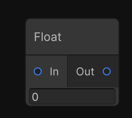
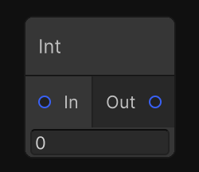
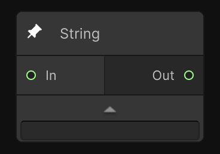

# 通用节点（Constant Node）

通用节点（Constant Node）是工作流的基础组件，提供数值、文本等输入输出能力。它们常作为参数源或逻辑连接点，帮助搭建更复杂的 AI Graph 工作流。

## 节点描述

| 节点名 | 示意图 | 描述 |
| ------ | ------ | ---- |
| Float  |  | 数值输入节点 |
| Int    |      | 整数数值输入节点 |
| String |  | 字符串输入节点，用于输入文本信息，如提示词 |

## 节点输入与输出

| 节点名 | 节点参数 | 节点输出 |
| ------ | -------- | -------- |
| Float  | Value（浮点数值） | Out（浮点数输出） |
| Int    | Value（整数数值） | Out（整数输出） |
| String | Value（字符串内容） | Out（字符串输出） |