# 腾讯混元节点（Tencent - Hunyuan Nodes）

腾讯混元节点基于腾讯混元大模型，覆盖图像生成、角色建模、姿态处理与动画生成等能力。适合需要快速完成从2D 输入到3D 输出的场景，比如角色原型设计、材质替换或动画预演。

## 节点描述

| 节点名 | 示意图 | 描述 |
| ------ | ------ | ---- |
| 动画生成   Animation | 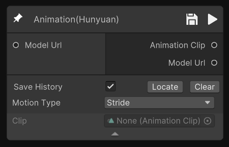 | 对生成3D角色模型实现自动绑骨蒙皮，选择不同动作模版生成3D动画 |
| 图生 PBR   ImageToPBR | 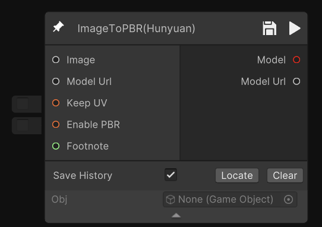 | 将输入的图像转化为PBR材质贴图 |
| 智能减面   LowPoly | 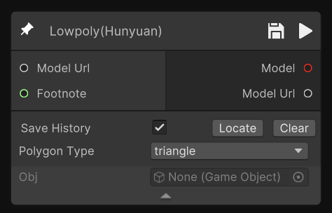 | 基于输入的3D模型，通过大模型算法进行减面，生成低面片且布线更规整的3D模型（可输出三角面/四边面） |
| 图生 3D   ImageToModel | 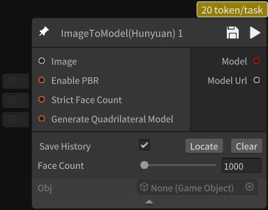 | 基于输入的单张图像生成3D模型 |
| URL 上传模型   UploadModelByUrl | 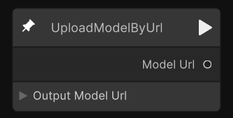 | 通过模型资源URL上传模型 |
| 姿态标准化   PoseStandardization | 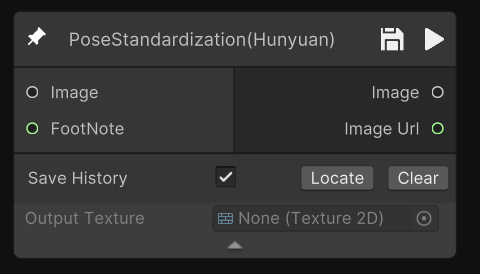 | 将输入角色姿态标准化，便于绑定骨骼与动画制作 |
| 图片去背景   RemoveBackground | 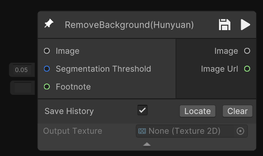 | 移除输入图像的背景，仅保留主体对象 |
| 草图生成 3D   SktechToMesh | 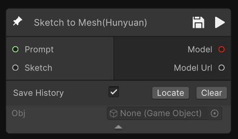 | 将线稿草图转化为模型 |
| 黑白稿生成   ControlnetGrayScale | 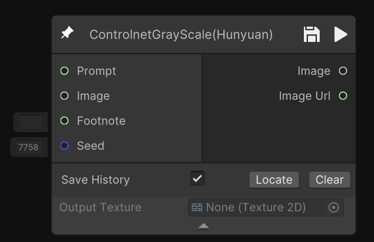 | 根据输入的prompt或参考图生成黑白稿图像 |
| GO 上传模型   UploadModelByGO |  | 将场景中的GameObject上传并转化为模型节点 |
| 自动绑骨   AutoRigging | 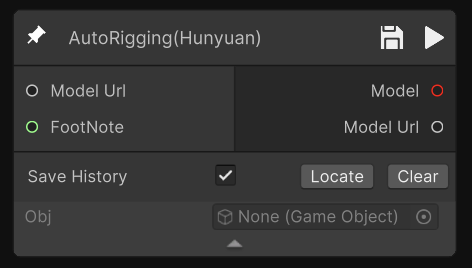 | 输入3D模型，利用算法对模型进行自动化骨骼蒙皮预测，并输出带骨骼蒙皮的3D模型 |
| 图像生成   ImageGenerating | 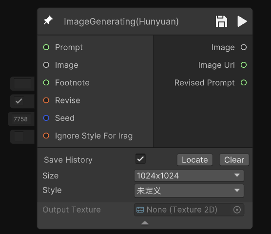 | 根据输入的提示词生成2D图像 |
| 图像编辑   CharacterEditing | 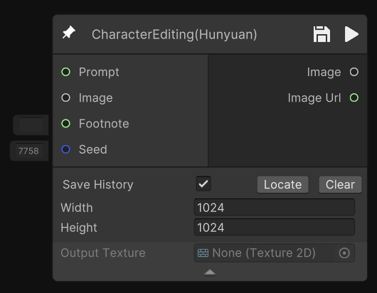 | 输入图像，选择生成图像对应的长宽比，对应扩图生成。可支持横版、竖版扩图 |
| UV 展开   SemanticUV   **1.0.5版本更新**   **旧版本节点已失效** | 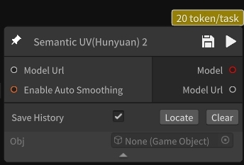 | 输入3D模型，输出带UV展开的3D模型 |
| 三视图生成模型   MultiviewToModel | 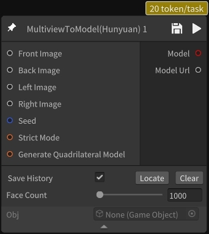 | 输入三视图，生成对应的3D模型 |
| 图生三视图   GeneratingThreeView |  | 输入图像，生成三视图素材 |
| 图片换背景   BackgroundReplacement | 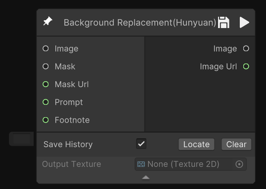 | 输入通用图像、图像中一个物体的mask以及描述物体之外的背景部分的文本，就可以生成对应的主体以及背景的效果 |
| 动作重定向   MotionRetarget | 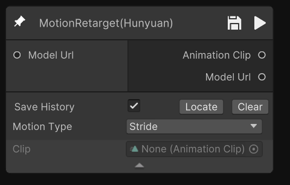 | 对生成的mesh模型实现预定义的动作驱动 |
| 多视图生纹理   MultiviewToTexture | 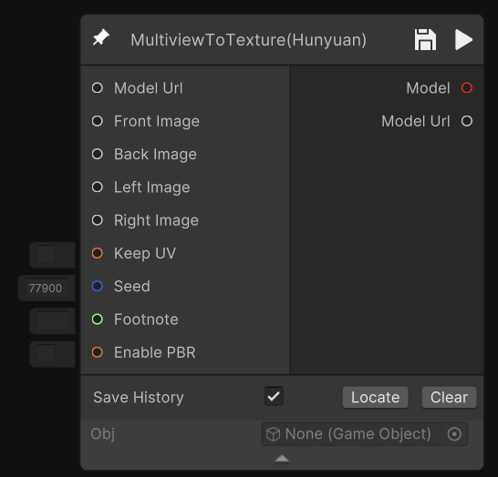 | 对生成的几何mesh，通过多图输入生成纹理 |
| 图片风格化   StyleSwitch | 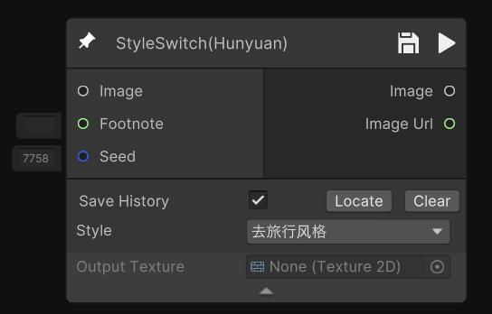 | 针对通用场景下的风格转换模型，上传图片，可实现图片风格转换功能，并保持画面结构与原图一致 |
| 图片清晰化   ImageClarity | 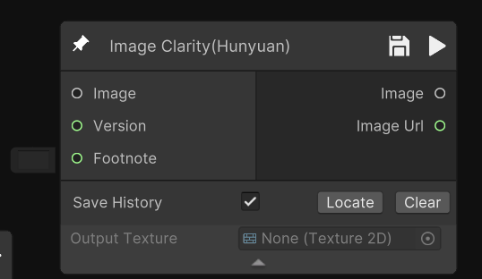 | 输入图像，输出变清晰后的图片。使其在视觉更加清晰、细节更加丰富 |
| 高级文生图   AdvancedTexttoImage | 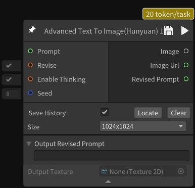 | 输入文字生成图片 |
| 图片编辑（游戏定制）   EditImageSpeciallyForGame   **1.0.5版本新增** | 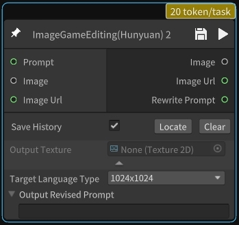 | 输入文字描述修改图片，专为游戏需求定制 |
| 文生3D   TextToModel   **1.0.5版本新增** | 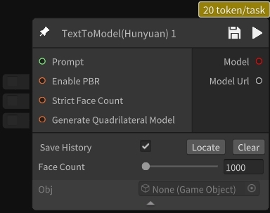 | 智能减面文生3D |
| 音频生成   SoundGenerating   **1.0.6版本新增** | 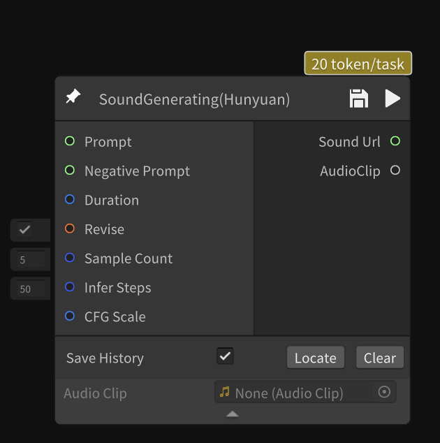 | 根据输入提示词生成音频内容 |

## 节点输入与输出

| 节点名 | 节点参数 | 节点输出 |
| ------ | -------- | -------- |
| 动画生成   Animation | • Model Url（模型地址） • Motion Type（动作类型） • Animation Clip（动画剪辑） | • Model Url（模型地址） |
| 图生 PBR   ImageToPBR | • Image（图像输入） • Model Url（模型地址） • Keep UV（保持UV） • Enable PBR（是否启用PBR材质） • Footnote（附注信息） | • Model模型（gameobject） • Model Url（模型地址） |
| 智能减面   LowPoly | • Model Url（模型地址） • Footnote（附注信息） • Polygon Type（多边形类型） | • Model模型（gameobject） • Model Url（模型地址） |
| 图生 3D   ImageToModel | • Image（图片节点连接） • Prompt（string中文或英文描述文本节点） • Seed（种子） • Enable PBR（启用PBR材质） • Strict Face Count（面数限制） • Face Count（面数上限） | • Model模型（gameobject） • Model Url（模型地址） |
| URL 上传模型   UploadModelByUrl | • Output Model Url（输出模型地址） | • Model Url（模型地址） |
| 姿态标准化   PoseStandardization | • Image（图片节点连接） • Footnote（附注信息） | • Image（图像输出） • Image Url（图像地址） |
| 图片去背景   RemoveBackground | • Image（图片节点连接） • Segmentation Threshold（分割阈值） • Footnote（附注信息） | • Image（图像输出） • Image Url（图像地址） |
| 草图生成 3D   SktechToMesh | • Prompt（string中文或英文描述文本节点） • Sketch（草图） | • Model模型（gameobject） • Model Url（模型地址） |
| 黑白稿生成   ControlnetGrayScale | • Prompt（string中文或英文描述文本节点） • Image（图片节点连接） • Footnote（附注信息） • Seed（种子） | • Model模型（gameobject） • Model Url（模型地址） |
| GO 上传模型   UploadModelByGO | • GameObject（场景对象） | • Model Url（模型地址） • Hunyuan Model Url（腾讯混元模型地址） |
| 自动绑骨   AutoRigging | • Model Url（模型地址） • Footnote（附注信息） | • Model模型（gameobject） • Model Url（模型地址） |
| 图像生成   ImageGenerating | • Prompt（string中文或英文描述文本节点） • Image（图像节点连接） • Revised Prompt（修订提示词） • Footnote（附注信息） • Revise（修正提示词） • Seed（种子） • Ignore Style For Irag（忽略风格设置） • Size（图像尺寸） • Style（图像风格） | • Image（图像输出） • Image Url（图像地址） |
| 图像编辑   CharacterEditing | • Prompt（string中文或英文描述文本节点） • Image（图片节点连接） • Footnote（附注信息） • Seed（种子） • Width（宽度） • Height（高度） | • Image（图像输出） • Image Url（图像地址） |
| UV 展开   SemanticUV   **1.0.5版本更新**   **旧版本节点已失效** | • Image（图片节点连接） • Model Url（模型地址） • Footnote（附注信息） | • Model模型（gameobject） • Model Url（模型地址） |
| 三视图生成模型   MultiviewToModel | • Front Image（前视图） • Back Image（后视图） • Left Image（左视图） • Right Image（右视图） • Seed（种子） | • Model模型（gameobject） • Model Url（模型地址） |
| 图生三视图   GeneratingThreeView | • Image（图片节点连接） | • Image（图像输出） • Image Url（图像地址） |
| 图片换背景   BackgroundReplacement | • Image（图片节点连接） • Mask（遮罩图像） • Mask Url（遮罩图像地址） • Prompt（string中文或英文描述文本节点） • Footnote（附注信息） | • Image（图像输出） • Image Url（图像地址） |
| 动作重定向   MotionRetarget | • Model Url（模型地址） • Motion Type（动作类型） • Animation Clip（动画剪辑） | • Model Url（模型地址） |
| 多视图生纹理   MultiviewToTexture | • Model Url（模型地址） • Front Image（前视图） • Back Image（后视图） • Left Image（左视图） • Right Image（右视图） • Keep UV（保持UV） • Seed（种子） • Footnote（附注信息） • Enable PBR（是否启用PBR材质） | • Model模型（gameobject） • Model Url（模型地址） |
| 图片风格化   StyleSwitch | • Image（图片节点连接） • Footnote（附注信息） • Seed（种子） • Style（风格） | • Image（图像输出） • Image Url（图像地址） |
| 图片清晰化   ImageClarity | • Image（图片节点连接） • Version（版本选择） • Footnote（附注信息） | • Image（图像输出） • Image Url（图像地址） |
| 高级文生图   AdvancedTexttoImage   **1.0.5版本新增**| • Prompt（string中文或英文描述文本节点） • Revise（是否开启prompt优化） • Enable Thinking（是否启动思考功能）  • Seed（种子）| • Image（图像输出） • Image Url（图像地址）  • Revised Prompt（优化后prompt）|
| 图片编辑（游戏定制）   EditImageSpeciallyForGame   **1.0.5版本新增** | • Prompt（string中文或英文描述文本节点） • Image（图像节点连接） • Image Url（图像地址）| • Image（图像输出） • Image Url（图像地址）  • Rewrite Prompt(优化后prompt)|
| 文生3D   TextToModel | • Prompt（string中文或英文描述文本节点） • Enable PBR（是否需要PBR纹理结果） • Strict Face Count（开启严格遵循面数限制）  • Generate Quadrilateral Model(按四边形面片生成模型)| • Model（模型） • Model Url（模型地址） |
| 音频生成   SoundGenerating   **1.0.6版本新增** | • Prompt（string中文或英文描述文本节点） • Negative Prompt（负向提示词） • Duration（时长） • Revise（修正提示词） • Sample Count（采样数量） • Infer Steps（推理步数） • CFG Scale（引导系数） | • Sound Url（音频地址） • AudioClip（音频片段） |
