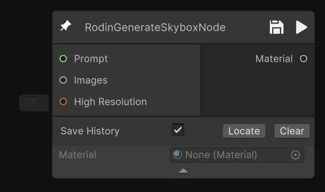
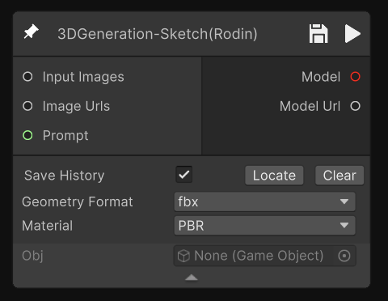
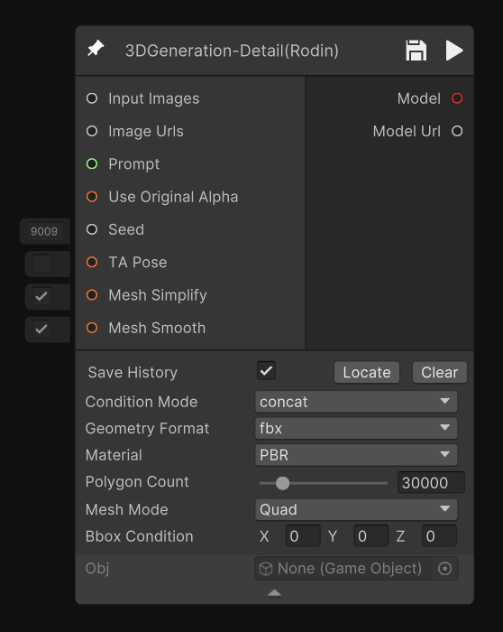
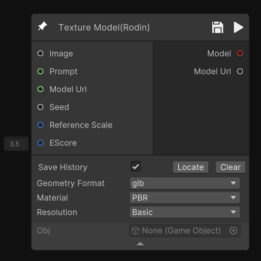
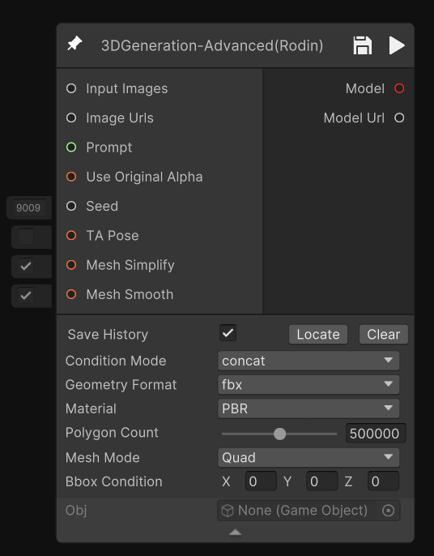
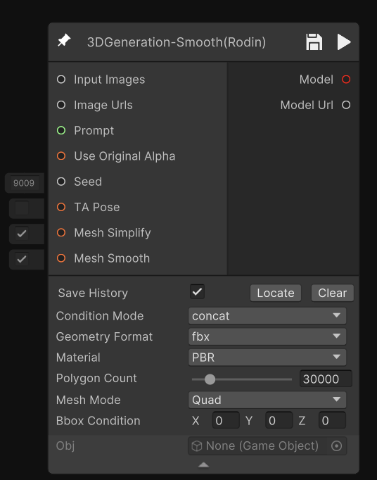
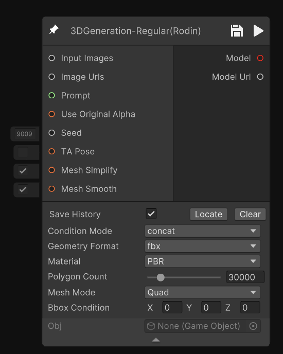

# Hyper3D - Rodin 节点（Hyper3D - Rodin Nodes）

Hyper3D - Rodin节点专注于高保真与艺术化的 3D 生成，支持草图建模、细节增强、风格化生成与天空盒制作。它们常用于创意设计与视觉表现，帮助开发者快速产出高水准的模型与场景效果。

## 节点描述

| 节点名 | 示意图 | 描述 |
| ------ | ------ | ---- |
| 天空盒   RodinGenerateSkyboxNode |  | 基于输入的提示词或参数生成高质量天空盒，用于场景环境搭建 |
| 草图生 3D   3DGeneration-Sketch |  | 根据草图生成三维模型初稿 |
| 精细 3D 模型生成   3DGeneration-Detail |  | 输入提示词/图像生成具备更多细节的3D模型 |
| 纹理生成   TextureModel |  | 为Rodin流程生成的模型自动创建高质量纹理贴图 |
| 高级 3D 模型生成   3DGeneration-Advanced |  | 提供高级3D生成流程，支持复杂输入和参数调控，适合高精度模型生成 |
| 平滑 3D 模型生成   3DGeneration-Smooth |  | 输入提示词/图像生成更加平滑的3D模型 |
| 标准 3D 模型生成   3DGeneration-Regular |  | 标准3D生成流程，平衡生成速度与模型质量，适合常规场景 |

## 节点输入与输出

| 节点名 | 节点参数 | 节点输出 |
| ------ | -------- | -------- |
| 天空盒   RodinGenerateSkyboxNode | • Prompt（string中文或英文描述文本节点） • Images（多视图图片节点连接） • High Resolutions | • Material（材质） |
| 草图生 3D   3DGeneration-Sketch | • Input Images（多视图图片节点连接） • Image Urls（图像地址） • Prompt（string中文或英文描述文本节点） • Geometry Format（几何体格式） • Material（材质） | • Model模型（gameobject） • Model Url（模型地址） |
| 精细 3D 模型生成   3DGeneration-Detail | • Input Images（多视图图片节点连接） • Image Urls（图像地址） • Prompt（string中文或英文描述文本节点） • Use Original Alpha（保留原始透明通道） • Seed（种子） • TA Pose（标准化T/A姿态） • Mesh Simplify（是否简化模型） • Mesh Smooth（是否平滑模型） • Condition Mode（条件模式） • Geometry Format（几何体格式） • Material（材质） • Polygon Count（面数） • Mesh Mode（模型类型） • Bbox Condition（包围盒条件） | • Model模型（gameobject） • Model Url（模型地址） |
| 纹理生成   TextureModel | • Image（图片节点连接） • Prompt（string中文或英文描述文本节点） • Model Url（模型地址） • Seed（种子） • Reference Scale（参考比例） • EScord（坐标参数） • Geometry Format（几何体格式） • Material（材质） • Resolution（分辨率） | • Model模型（gameobject） • Model Url（模型地址） |
| 高级 3D 模型生成   3DGeneration-Advanced | • Input Images（多视图图片节点连接） • Image Urls（图像地址） • Prompt（string中文或英文描述文本节点） • Use Original Alpha（保留原始透明通道） • Seed（种子） • TA Pose（标准化T/A姿态） • Mesh Simplify（是否简化模型） • Mesh Smooth（是否平滑模型） • Condition Mode（条件模式） • Geometry Format（几何体格式） • Material（材质） • Polygon Count（面数） • Mesh Mode（模型类型） • Bbox Condition（包围盒条件） | • Model模型（gameobject） • Model Url（模型地址） |
| 平滑 3D 模型生成   3DGeneration-Smooth | • Input Images（多视图图片节点连接） • Image Urls（图像地址） • Prompt（string中文或英文描述文本节点） • Use Original Alpha（保留原始透明通道） • Seed（种子） • TA Pose（标准化T/A姿态） • Mesh Simplify（是否简化模型） • Mesh Smooth（是否平滑模型） • Condition Mode（条件模式） • Geometry Format（几何体格式） • Material（材质） • Polygon Count（面数） • Mesh Mode（模型类型） • Bbox Condition（包围盒条件） | • Model模型（gameobject） • Model Url（模型地址） |
| 标准 3D 模型生成   3DGeneration-Regular | • Input Images（多视图图片节点连接） • Image Urls（图像地址） • Prompt（string中文或英文描述文本节点） • Use Original Alpha（保留原始透明通道） • Seed（种子） • TA Pose（标准化T/A姿态） • Mesh Simplify（是否简化模型） • Mesh Smooth（是否平滑模型） • Condition Mode（条件模式） • Geometry Format（几何体格式） • Material（材质） • Polygon Count（面数） • Mesh Mode（模型类型） • Bbox Condition（包围盒条件） | • Model模型（gameobject） • Model Url（模型地址） |