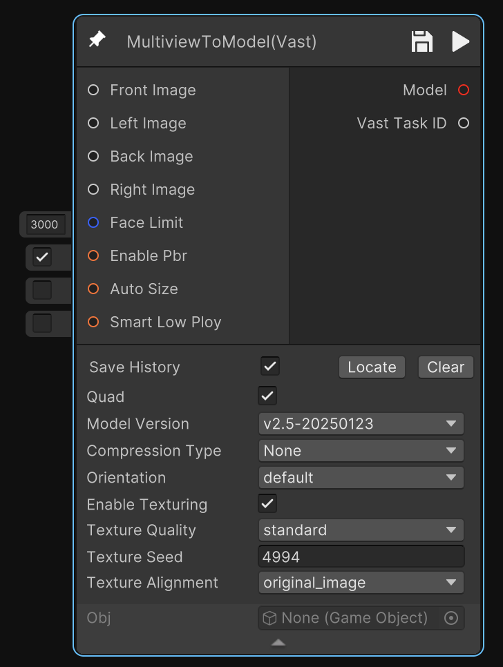
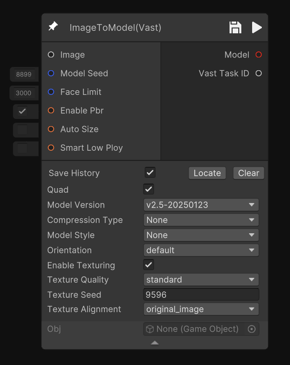
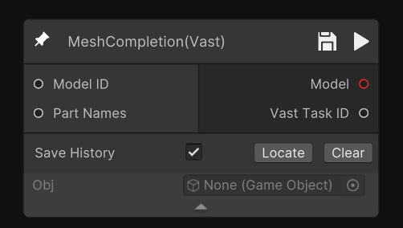
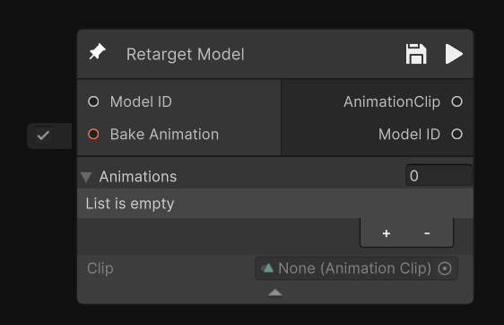
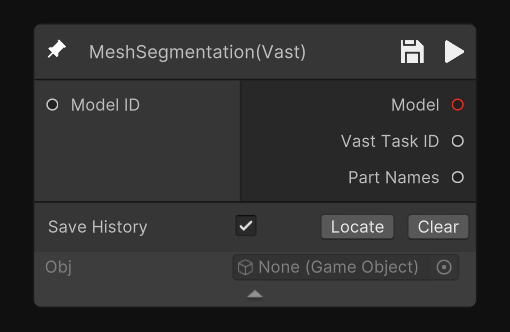
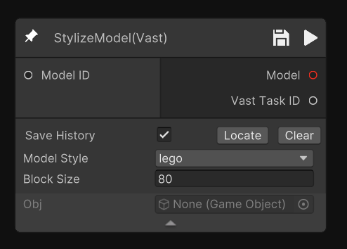
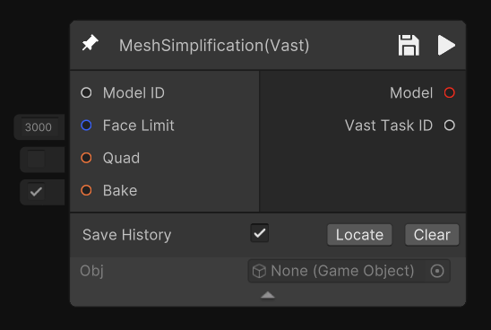
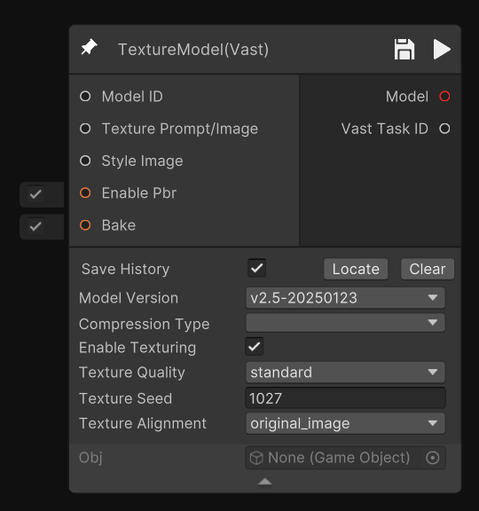
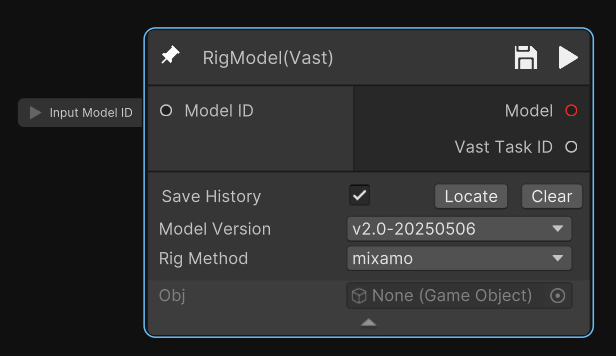
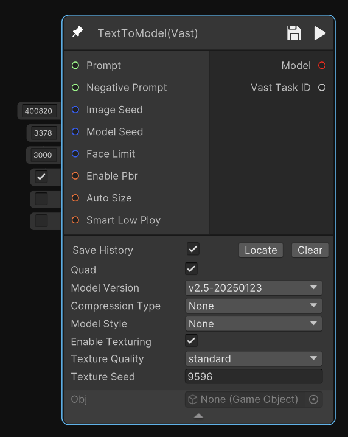

# Tripo - Vast节点（Tripo - Vast Nodes）

Tripo - Vast 节点由 Tripo AI 提供，包含多视角 3D 重建、网格优化、贴图生成和 Rigging。可用于处理复杂三维资产，提升模型完整性与渲染效率，适用于游戏开发与大规模三维内容生产。

## 节点描述

| 节点名 | 示意图 | 描述 |
| ------ | ------ | ---- |
| 多视图生 3D   MultiviewToModel |  | 输入多视角图像生成3D模型 |
| 图生 3D   ImageToModel |  | 输入图像生成3D模型 |
| 模型自动补全   MeshCompletion |  | 自动补全缺失的网格数据，修复不完整或破损的模型 |
| 重定向   Retarget |  | 将源动作数据重定向到目标模型，实现跨角色动作复用 |
| 模型分割   MeshSegmentation |  | 对网格进行语义分割，识别并划分模型的不同部位 |
| 模型风格化   StylizeModel |  | 将输入的模型应用风格化处理，改变整体视觉风格 |
| 模型减面   MeshSimplification |  | 对模型进行网格简化，减少面数，优化性能同时保持外观 |
| 材质生成   TextureModel |  | 根据输入模型ID自动生成或替换纹理贴图，支持多种材质类型 |
| 自动绑骨   RigModel |  | 自动为模型生成骨骼结构和绑定信息，使模型能够驱动动画 |
| 文生 3D   TextToModel |  | 根据输入的文本prompt描述，直接生成3D模型 |

## 节点输入与输出

| 节点名 | 节点参数 | 节点输出 |
| ------ | -------- | -------- |
| 多视图生 3D   MultiviewToModel | • Images（多视图图片节点连接） • Face Limit（可选，面数上限） • Enable Pbr（是否提供pbr材质） • Auto Size（自动将模型放缩真实比例，单位为米） • Smart Low Poly（是否减面） • Model Version（模型版本） • Compression Type（压缩选项，无压缩或者基于几何形状的压缩） • Orientation（align image会跟着图片旋转） • Enable Texturing（是否支持贴图） • Texture Quality（贴图质量） • Texture Seed（种子）（贴图种子） • Texture Alignment（贴图依据优先级） | • Model模型（gameobject） • Model ID（模型唯一标识符） |
| 图生 3D   ImageToModel | • Image（图片节点连接） • Model Seed（种子）（可选，模型种子） • Face Limit（可选，面数上限） • Enable Pbr（是否提供pbr材质） • Auto Size（自动将模型放缩真实比例，单位为米） • Smart Low Poly（是否减面） • Model Version（模型版本） • Compression Type（压缩选项，无压缩或者基于几何形状的压缩） • Model Style（模型风格） • Orientation（align image会跟着图片旋转） • Enable Texturing（是否支持贴图） • Texture Quality（贴图质量） • Texture Seed（种子）（贴图种子） • Texture Alignment（贴图依据优先级） | • Model模型（gameobject） • Model ID（模型唯一标识符） |
| 模型自动补全   MeshCompletion | • Model ID（模型唯一标识符） • Part Names（部件名称） | • Model模型（gameobject） • Model ID（模型唯一标识符） |
| 重定向   Retarget | • Model ID（模型唯一标识符） • Bake Animation（是否烘焙动画） • Animation Clip | • Model ID（模型唯一标识符） |
| 模型分割   MeshSegmentation | • Model ID（模型唯一标识符） | • Model模型（gameobject） • Model ID（模型唯一标识符） • Part Names（部件名称） |
| 模型风格化   StylizeModel | • Model ID（模型唯一标识符） • Model Style（模型风格） • Block Size（分块大小） | • Model模型（gameobject） • Model ID（模型唯一标识符） |
| 模型减面   MeshSimplification | • Model ID（模型唯一标识符） • Face Limit（可选，面数上限） • Quad（四边形） • Bake（是否烘焙） | • Model模型（gameobject） • Model ID（模型唯一标识符） |
| 材质生成   TextureModel | • Model ID（模型唯一标识符） • Texture Prompt/Image（材质prompt或参考图） • Enable Pbr（是否提供pbr材质） • Bake（是否烘焙） • Model Version（模型版本） • Compression Type（压缩选项，无压缩或者基于几何形状的压缩） • Model Style（模型风格） • Enable Texturing（是否支持贴图） • Texture Quality（贴图质量） • Texture Seed（种子）（贴图种子） • Texture Alignment（贴图依据优先级） | • Model模型（gameobject） • Model ID（模型唯一标识符） |
| 自动绑骨   RigModel | • Model ID（模型唯一标识符） • Model Version（模型版本） • Rig Method（绑定方式） | • Model模型（gameobject） • Model ID（模型唯一标识符） |
| 文生 3D   TextToModel | • Prompt（string中文或英文描述文本节点） • Negative Prompt（可选，string中文或英文负面描述） • Image Seed（种子）（可选，图片种子） • Model Seed（种子）（可选，模型种子） • Face Limit（可选，面数上限） • Enable Pbr（是否提供pbr材质） • Auto Size（自动将模型放缩到真实比例，单位为米） • Smart Low Poly（是否减面） • Model Version（模型版本） • Compression Type（压缩选项，无压缩或者基于几何形状的压缩） • Model Style（模型风格） • Enable Texturing（是否支持贴图） • Texture Quality（贴图质量） • Texture Seed（种子）（贴图种子） | • Model模型（gameobject） • Model ID（模型唯一标识符） |