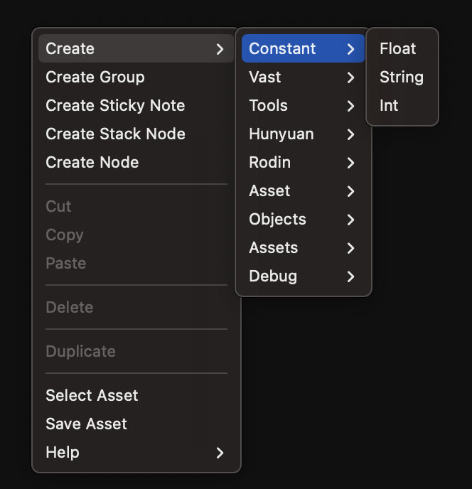
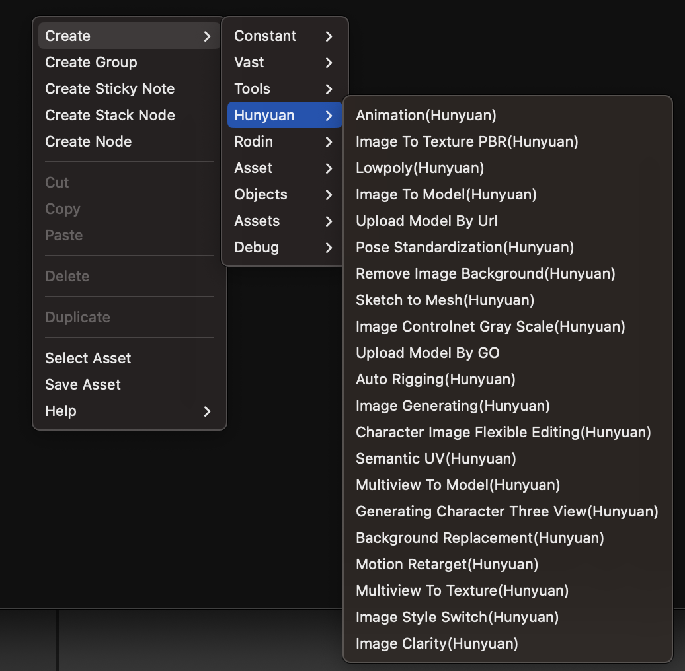
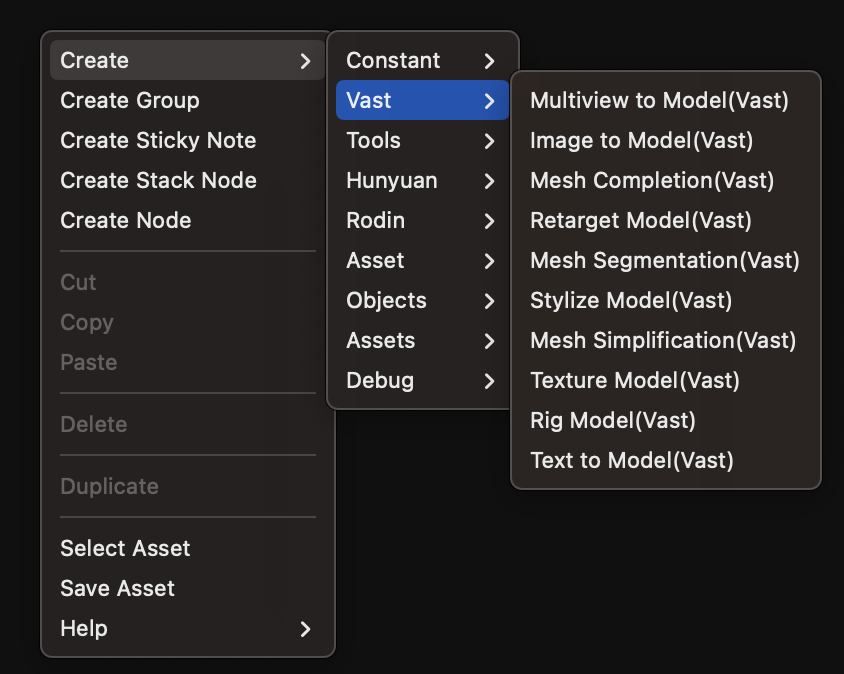
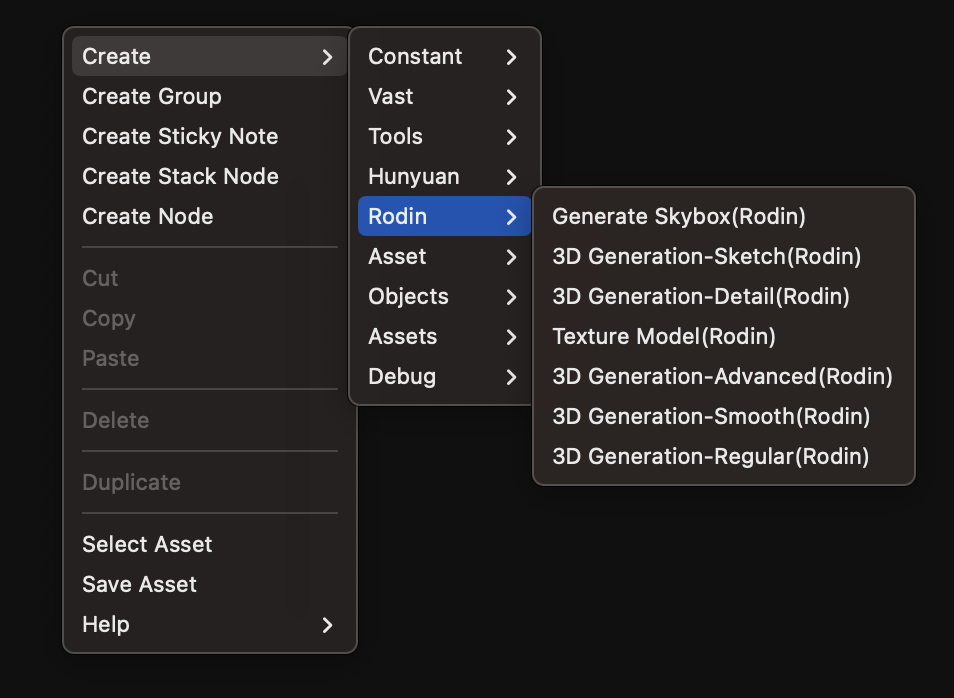
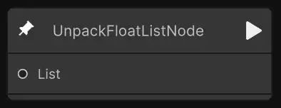
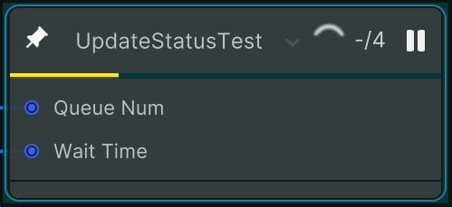
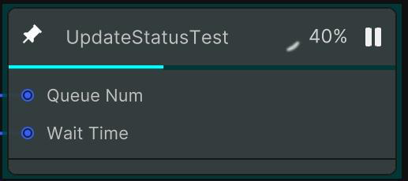
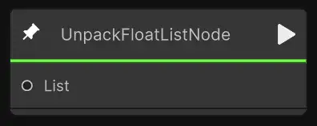
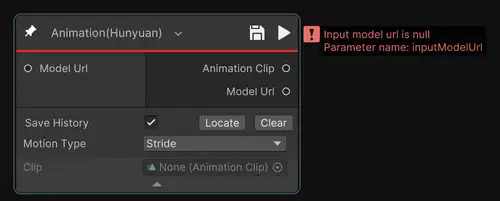

# 节点库（Node Library）

## 描述

节点库（Node Library）汇集了团结 AI Graph的全部功能节点，涵盖从基础数据输入到高阶 3D 内容生成的完整能力。开发者可以在工作流中自由组合节点，实现从 2D 图像/文本输入到3D 模型/材质/动画输出的端到端自动化生产流程。

团结AI目具备第三方大模型API调用能力，您无需重复接入多个模型或服务端口，即可在引擎环境中直接调用第三方AIGC大模型的AI生成能力。

团结 AI Graph 内置了多类节点：

* [通用节点（Constant Nodes）](TJAI-Graph-nodeConstant.md)
* [腾讯混元节点（Tencent - Hunyuan Nodes）](TJAI-Graph-nodeHunyuan.md)
* [Tripo - Vast 节点（Tripo - Vast Nodes）](TJAI-Graph-nodeVast.md)
* [Hyper3D - Rodin 节点（Hyper3D - Rodin Nodes）](TJAI-Graph-nodeRodin.md)

通过与腾讯混元、Tripo - Vast、Hyper3D - Rodin等战略合作伙伴的深度集成，节点库为开发者带来跨模态、跨模型的标准化组件，帮助快速搭建工作流并提升生产效率。

节点库包含AI Graph中所有各个节点的文档，包括描述、端口、参数和示例图像，方便查阅与使用。

| 节点类型 | 通用节点 | 腾讯混元节点 | Tripo - Vast 节点 | Hyper3D - Rodin 节点 |
| -------- | -------- | -------- | --------- | ---------- |
| 示例图   |  |  |  |  |

## 节点状态说明

在使用节点时，不同的状态颜色代表节点的运行情况，具体如下：

| 状态颜色 | 描述 | 参考图 |
| ---- | -------- | -------- |
| 无特殊颜色 | 初始化 |  |
| 黄色 | 正在排队中 |  |
| 蓝色 | 正在运行 |  |
| 绿色 | 执行成功 |  |
| 红色 | 执行失败，同时会弹出error报错信息 |  |