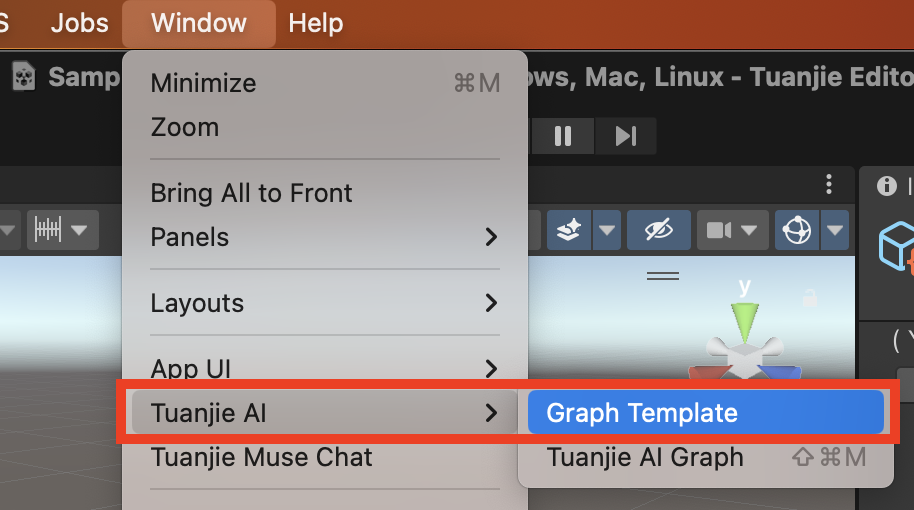
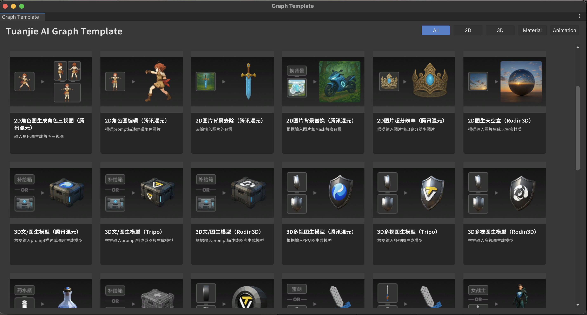
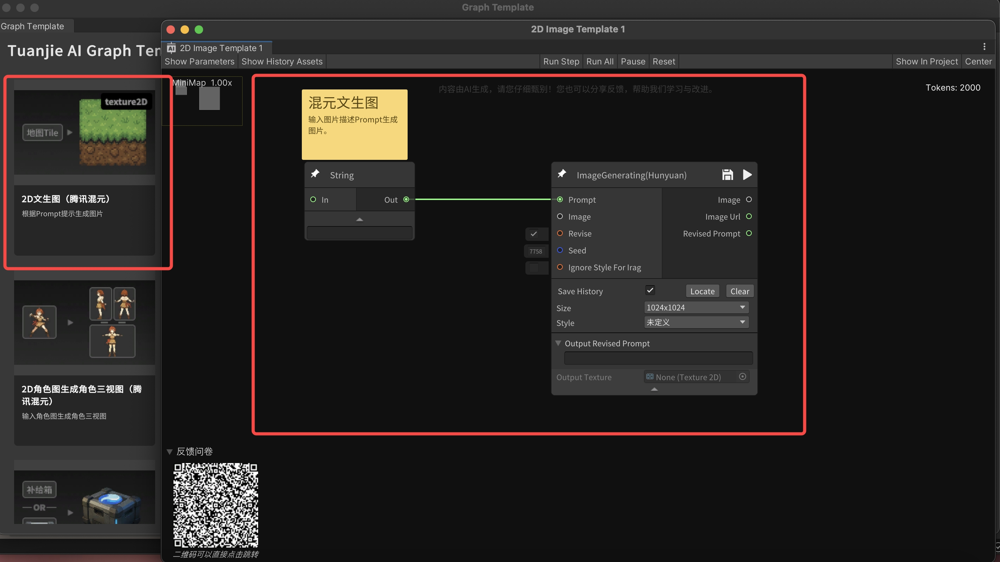

# 工作流模板

每一个Tuanjie AI Graph都可以被您保存为模版，团结引擎也会内置几十种预制好的AI Graph作为模版以便您快速上手。这些模版的集合，我们称为Tuanjie AI Graph Template。

## 工作流模板入口

在 **Editor** 中点击 **Window -> Tuanjie AI -> Graph Template**

## 工作流界面

工作流界面（Tuanjie AI Graph Template界面）集中展示了团结 AI Graph 内置的预设模板。界面上按类别（2D、3D、材质、动画等）分区排列，用户可以快速浏览并选择所需的模版。

* **左侧分类栏**：提供不同类型的入口（2D、3D、Material、Animation），方便用户快速筛选。

* **中央模板展示区**：以卡片形式展示可用的 Graph 模板，每张卡片包含名称、来源（如腾讯混元、Tripo - Vast、Hyper3D - Rodin）、以及简要说明。

* **操作方式**：点击任意模板，即可进入相应的工作流编辑界面。

## 工作流模板内容

点击某一模板后，系统会自动加载对应的工作流 Graph，并显示完整的节点结构。

