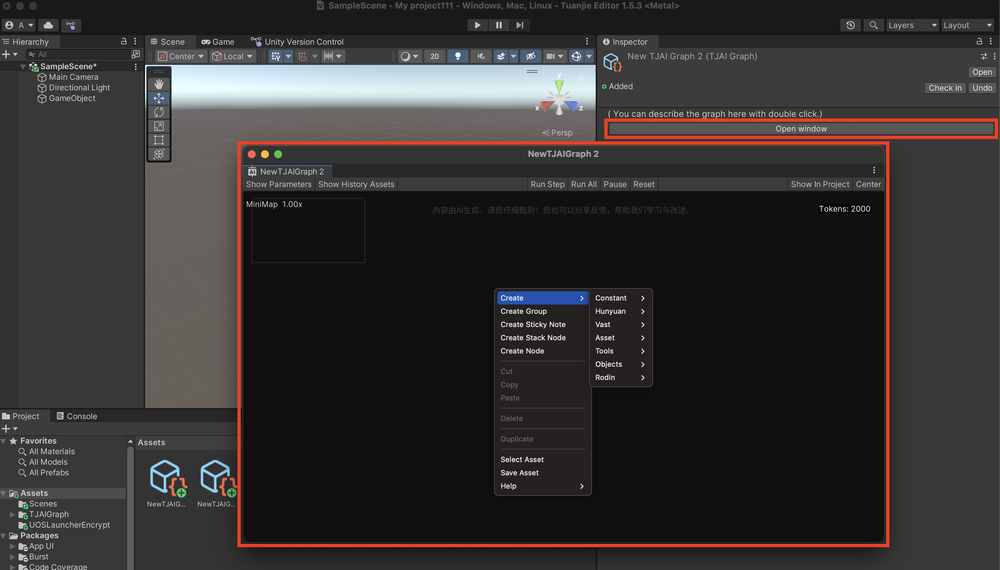
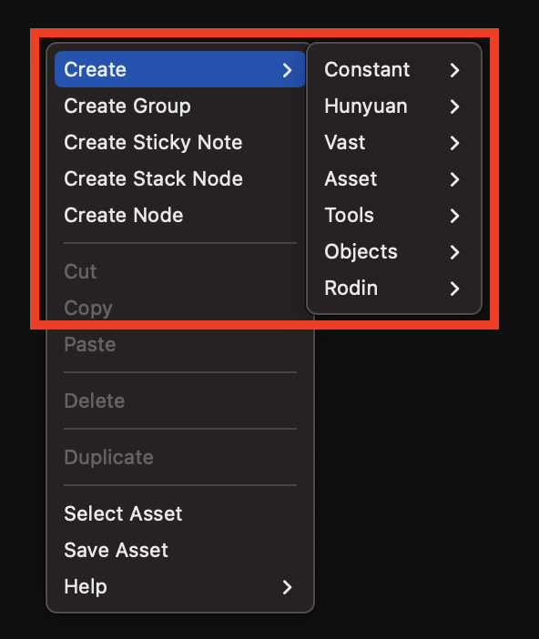
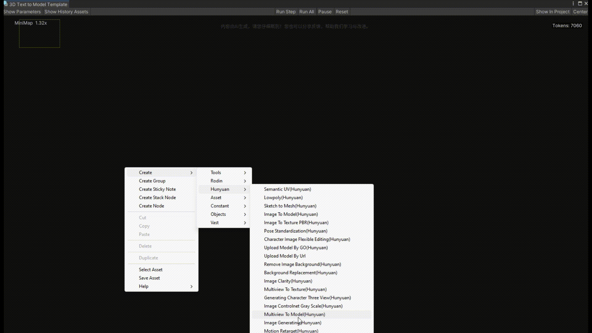

# AI Graph 窗口

您新建的AI Graph文件会出现在您所在的Assets Folder里，同时右侧inspector会出现TJAI Graph的面板。点击Open window按键则会弹出AI Graph窗口面板。

## 创建节点：

使用 Create Node 菜单创建新的节点。打开菜单有两种方式：

1. 右键单击，然后从上下文菜单中选择 Create Node。

2. 按空格键。

## 面板功能说明

| 功能名称 | 功能类型 | 功能描述 |
| -------- | -------- | -------- |
| 创建群组  Create Group | 节点功能 | 创建 group，可在里面放入多个相连接节点，形成一个功能节点组 |
| 创建堆栈  Create Stack Node | 节点功能 | 创建 stack，可在里面放入多个相同或相似代码节点，方便管理 |
| 创建粘滞签  Create Sticky Node | 节点功能 | 创建便签，可以对 Graph 注释说明使用 |
| 展示参数  Show Parameters | 其他 | 创建图表的输入输出节点，用于更改和外界交互 |
| 展示历史资产  Show History Assets | 其他 | 展示历史已生成的结果 |
| 按步生成  Run Step | 生成步骤 | 按节点向前依次，点击一次执行所有相连接处理节点 |
| 全部生成  Run All | 生成步骤 | 按节点向前依次，点击一次执行所有节点 |
| 生成暂停  Pause | 生成步骤 | 暂停当前执行的节点 |
| 重置  Reset | 生成步骤 | 重置所有节点状态 |
| 文件定位  Show in Project | 其他 | 在 Asset 里显示 Graph 所在的位置 |
| 置中  Center | 其他 | 将 Graph 版面回到中间位置显示 |
| 导出  Export | 历史资产 | 下载历史资产里的项目 |
| 还原  Restore | 历史资产 | 将历史资产里的项目重新加载到节点 |
| 删除  Delete | 历史资产 | 删除历史资产的项目 |

## 键鼠操作

| 操作     | 操作方式                         | 操作详讯说明 |
| -------- | -------------------------------- | ------------ |
| 删除     | 键盘 delete                       | 删除选中节点或连线 |
| 撤销     | 键盘 ctrl+z                       | 撤销上一步操作 |
| graph 移动 | 鼠标中键拖动                      | 拖动画布，移动整个 graph 视图 |
| 资产导入 | 将标志 asset 中的文件拖入 graph    | 将外部资源文件直接导入 graph，自动生成相应节点 |
| 参数设置 | 将节点参数拖拽至上方               | 显示参数设置界面 |
| 创建群组 | 右键菜单 -> Create Group          | 在 group 内加入多个相连的节点，形成功能节点组，便于统一管理 |
| 创建堆栈 | 右键菜单 -> Create Stack          | 在 stack 内加入多个相同或相似代码节点，方便集中管理和复用 |

### 管线搭建案例
